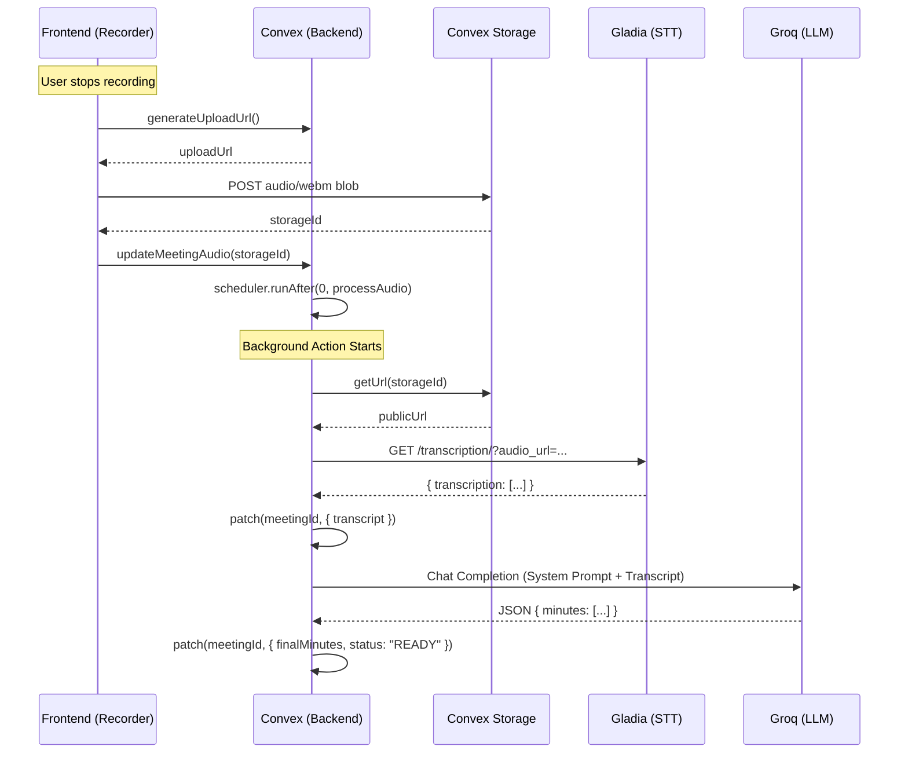
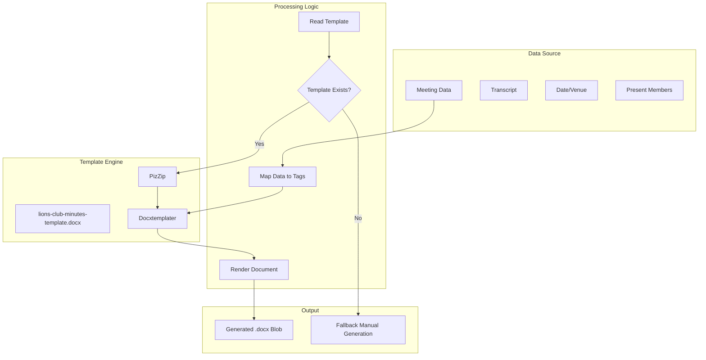
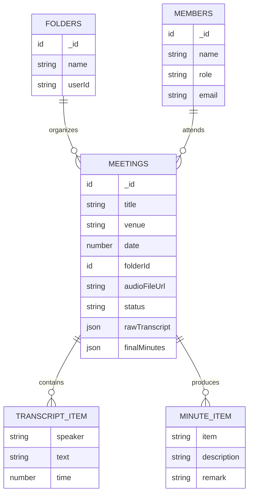
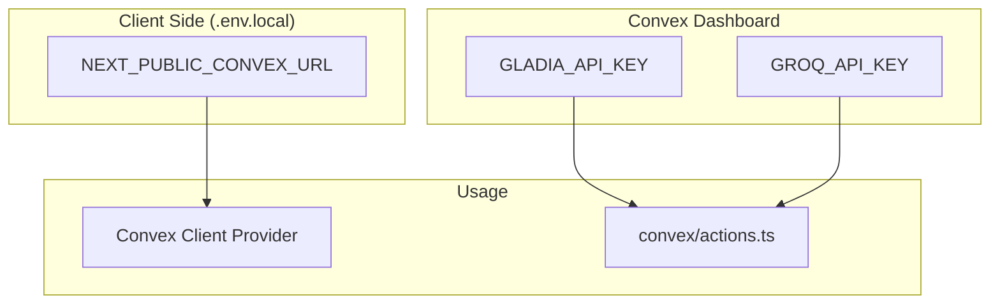

# 🔧 Technical Documentation

> Architecture and flow diagrams for Lions' Club AI Secretary

---

## 📐 System Architecture

```mermaid
flowchart TB
    subgraph Frontend["Frontend (Next.js 14)"]
        DASH[Dashboard Page]
        MR[Meeting Recorder]
        ME[Minutes Editor]
        SD[Settings Dialog]
        API_CLIENT[Convex React Client]
    end

    subgraph Backend["Backend (Convex)"]
        ACT[server/actions.ts]
        MUT[server/mutations.ts]
        QRY[server/queries.ts]
        SCH[Database Schema]
        STO[File Storage]
        CRON[Cron Jobs]
    end

    subgraph External["External APIs"]
        GLADIA[Gladia API<br/>(Speech-to-Text)]
        GROQ[Groq API<br/>(LLM / Llama 3)]
    end

    subgraph DB["Convex Database"]
        MEETINGS[(Meetings Table)]
        FOLDERS[(Folders Table)]
        MEMBERS[(Members Table)]
    end

    DASH --> |Queries| QRY
    DASH --> |Mutations| MUT
    MR --> |Mutations| MUT
    MR --> |File Upload| STO
    ME --> |Queries| QRY
    ME --> |Actions| ACT

    ACT --> |Fetch| GLADIA
    ACT --> |Chat| GROQ
    
    MUT --> SCH
    QRY --> SCH
    SCH --> MEETINGS
    SCH --> FOLDERS
    SCH --> MEMBERS

    ACT --> |Save| MEETINGS
```

---

## 🎮 User Flow

```mermaid
flowchart LR
    subgraph Dashboard["1. Dashboard"]
        A[View Meetings] --> |Click New| B[Create Meeting]
        B --> |Input Info| C[Recorder Page]
    end
    
    subgraph Recording["2. Recording Session"]
        C --> D[Start Record]
        D --> E[Pause/Resume]
        E --> F[Stop]
        F --> G{Review}
        G --> |Discard| D
        G --> |Save| H[Process Audio]
    end
    
    subgraph Processing["3. AI Processing"]
        H --> I[Upload to Convex]
        I --> J[Trigger Action]
        J --> K[Gladia Transcribe]
        K --> L[Groq Generate Minutes]
        L --> M[Store Results]
    end
    
    subgraph Editing["4. Review & Export"]
        M --> N[Minutes Editor]
        N --> O[Listen & Verify]
        O --> P[Edit Items]
        P --> Q[Save Draft]
        Q --> R[Export DOCX]
    end
```



---

## 🤖 Feature: Audio Processing Flow



---

## ⚔️ Template Export System



---

## 🏗️ Folder Structure

```mermaid
graph TD
    ROOT[ai-secretary/]
    
    subgraph App["/app (Next.js)"]
        PAGE[page.tsx<br/>(Dashboard)]
        MEETING_PAGE[meeting/[id]/page.tsx]
        LAYOUT[layout.tsx]
        GLOBALS[globals.css]
    end

    subgraph Convex["/convex (Backend)"]
        SCHEMA[schema.ts]
        ACTIONS[actions.ts]
        MEETINGS[meetings.ts]
    end

    subgraph Components["/components"]
        UI[ui/<br/>(Shadcn Components)]
        REC[MeetingRecorder.tsx]
        EDIT[MinutesEditor.tsx]
        SET[SettingsDialog.tsx]
    end
    
    ROOT --> App
    ROOT --> Convex
    ROOT --> Components
```

---

## 📊 Data Models



---

## 🔐 Environment Variables



---

<p align="center">
  <b>Built for Lions Club KL Vision City</b>
</p>
